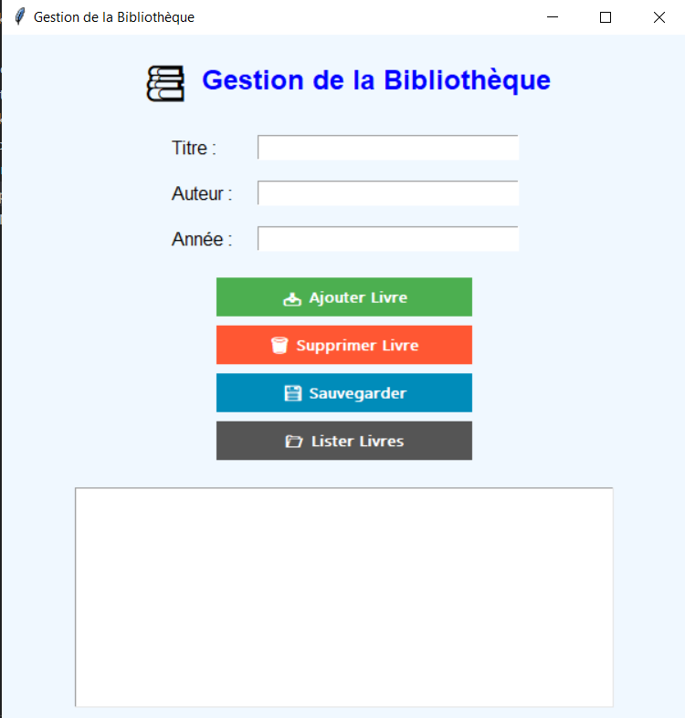

## Gestion d'une Bibliothèque

Ce projet est une application de gestion de bibliothèque développée en Python avec Tkinter pour l'interface utilisateur. Il permet d'ajouter, de supprimer et de consulter des livres, ainsi que de sauvegarder et de charger la liste des livres à partir d'un fichier texte.

### Fonctionnalités

📥 Ajouter un livre avec un titre, un auteur et une année de publication.
🗑️ Supprimer un livre en utilisant son titre.
📂 Lister tous les livres disponibles dans la bibliothèque.
💾 Sauvegarder les livres dans un fichier texte.
📜 Charger les livres à partir d'un fichier texte.

### Réalisation

### 🛠 Technologies Utilisées

Python 🐍 (Programmation principale)
Tkinter 🎨 (Interface graphique)

### 🚀 Installation et Exécution

Clonez le dépôt
cd python-library-management-system
Exécutez le programme : python main.py

👤 Realisé par :
[Abrkaoui abdellah](https://github.com/Abdellah-Abrkaoui)
[Abassari Mohammed](https://github.com/mohamedabassari)
